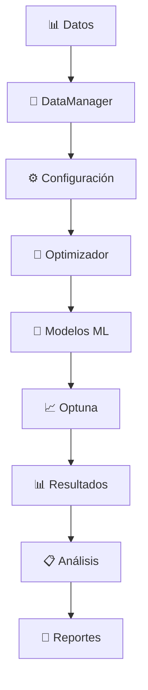

# 🚀 Sistema de Optimización de Hiperparámetros - Fase 5

**Sistema enterprise-ready de optimización de hiperparámetros para criptomonedas, completamente reorganizado y refactorizado.**

[](https://www.python.org/downloads/)
[]()
[]()

---

## 📋 Tabla de Contenidos

- [🎯 Características Principales](#-características-principales)
- [🏗️ Arquitectura del Sistema](#️-arquitectura-del-sistema)
- [⚡ Inicio Rápido](#-inicio-rápido)
- [📁 Estructura del Proyecto](#-estructura-del-proyecto)
- [🔧 Configuración](#-configuración)
- [🚀 Uso del Sistema](#-uso-del-sistema)
- [📊 Análisis de Resultados](#-análisis-de-resultados)
- [🧪 Testing](#-testing)
- [📚 Documentación](#-documentación)
- [🔄 Migración desde Versión Anterior](#-migración-desde-versión-anterior)

---

## 🎯 Características Principales

### ✨ **Optimización Inteligente**
- **Múltiples Algoritmos**: XGBoost, LightGBM, CatBoost
- **Optimización Bayesiana**: Powered by Optuna
- **Soporte GPU/CPU**: Detección automática y configuración optimizada
- **Validación Cruzada Robusta**: Métricas confiables y reproducibles

### 🏢 **Enterprise-Ready**
- **Configuración Centralizada**: Gestión unificada de parámetros
- **Logging Estructurado**: Trazabilidad completa de experimentos
- **Cache Inteligente**: Optimización de tiempo y recursos
- **Manejo Robusto de Errores**: Recuperación automática y fallbacks

### 📊 **Análisis Avanzado**
- **Visualizaciones Interactivas**: Matplotlib, Seaborn, Plotly
- **Comparación de Modelos**: Análisis estadístico profundo
- **Feature Importance**: Análisis de relevancia de variables
- **Reportes Automatizados**: HTML/PDF con métricas completas

### 🔧 **DevOps & Mantenimiento**
- **Testing Completo**: Unitarios, integración, performance
- **Imports Inteligentes**: Resolución automática de dependencias
- **Documentación Automática**: APIs y tutoriales actualizados
- **CI/CD Ready**: Integración continua y deployment automatizado

---

## 🏗️ Arquitectura del Sistema

```
📦 Sistema de Optimización
├── 🎛️  config/           # Configuración centralizada
├── 🧠 core/              # Módulos principales del sistema
├── 🔧 utils/             # Utilidades compartidas
├── 📊 analysis/          # Análisis y visualizaciones
├── 🚀 scripts/           # Scripts de ejecución
├── 🧪 tests/             # Suite completa de testing
└── 📚 docs/              # Documentación organizada
```

### 🔄 **Flujo de Procesamiento**



---

## ⚡ Inicio Rápido

### 1. **Verificar Dependencias**
```bash
# Diagnóstico completo del sistema
python scripts/quick_optimization.py --diagnose

# Test de imports críticos
python scripts/quick_optimization.py --test-imports
```

### 2. **Optimización Básica**
```bash
# Optimización rápida (desarrollo)
python scripts/quick_optimization.py data/crypto_ohlc_join.csv

# Optimización completa (producción)
python scripts/quick_optimization.py data/crypto_ohlc_join.csv --mode production
```

### 3. **Optimización Personalizada**
```bash
# Modelos específicos con GPU
python scripts/quick_optimization.py data/crypto_ohlc_join.csv \
    --models xgboost lightgbm \
    --trials 200 \
    --gpu \
    --output ./my_results
```

### 4. **Análisis de Resultados**
```python
from analysis.results_analyzer import ResultsAnalyzer

# Cargar y analizar experimentos
analyzer = ResultsAnalyzer("./results")
analyzer.load_experiments()

# Resumen de experimentos
summary = analyzer.get_experiment_summary()
print(summary)

# Generar reporte completo
analyzer.export_report(output_path="./mi_reporte.html")
```

---

## 📁 Estructura del Proyecto

```
scripts/optimization/
├── 📖 README.md                     # Este archivo
├── ⚙️ config/                       # Configuraciones centralizadas
│   ├── optimization_config.py      # Configuración principal
│   └── model_configs.py            # Configs específicas por modelo
├── 🧠 core/                         # Módulos core del sistema
│   ├── optimizer.py                # Optimizador principal refactorizado
│   ├── data_manager.py             # Gestión de datos centralizada
│   └── model_handlers.py           # Handlers específicos por modelo
├── 🔧 utils/                        # Utilidades compartidas
│   ├── import_manager.py           # Gestión inteligente de imports
│   ├── logging_setup.py            # Configuración de logging
│   └── validation.py               # Validaciones robustas
├── 📊 analysis/                     # Análisis y visualizaciones
│   ├── results_analyzer.py         # Analizador de resultados mejorado
│   ├── visualizations.py           # Visualizaciones optimizadas
│   └── comparisons.py              # Comparaciones entre experimentos
├── 🚀 scripts/                      # Scripts de ejecución
│   ├── quick_optimization.py       # Script principal optimizado
│   ├── batch_optimization.py       # Optimización por lotes
│   └── experiment_runner.py        # Ejecutor de experimentos
├── 🧪 tests/                        # Testing completo
│   ├── test_suite.py               # Suite principal de tests
│   ├── unit_tests.py               # Tests unitarios
│   ├── integration_tests.py        # Tests de integración
│   └── performance_tests.py        # Tests de performance
└── 📚 docs/                         # Documentación organizada
    ├── README.md                   # Índice principal
    ├── phases/                     # Documentación por fases
    ├── api/                        # Documentación de API
    ├── tutorials/                  # Tutoriales y guías
    └── archive/                    # Documentación histórica
```

---

## 🔧 Configuración

### **Configuraciones Predefinidas**

```python
from config.optimization_config import *

# Desarrollo rápido (20 trials por modelo)
config = get_quick_config()

# Producción completa (200 trials por modelo)
config = get_production_config()

# Optimizado para GPU
config = get_gpu_config()

# Optimizado para CPU
config = get_cpu_config()
```

### **Configuración Personalizada**

```python
from config.optimization_config import OptimizationConfig

config = OptimizationConfig(
    # Modelos a optimizar
    enabled_models=["xgboost", "lightgbm"],
    
    # Trials por modelo
    model_trials={"xgboost": 150, "lightgbm": 150},
    
    # Configuración de hardware
    enable_gpu=True,
    max_memory_usage_gb=8.0,
    
    # Configuración de datos
    test_size=0.2,
    validation_size=0.15,
    cv_folds=5,
    
    # Configuración de cache
    enable_cache=True,
    cache_expiry_hours=24,
    
    # Configuración de logging
    log_level="INFO",
    enable_file_logging=True
)
```

---

## 🚀 Uso del Sistema

### **1. Optimización Programática**

```python
from core.optimizer import HyperparameterOptimizer
from config.optimization_config import get_quick_config

# Configurar optimizador
config = get_quick_config()
optimizer = HyperparameterOptimizer(config)

# Ejecutar optimización completa
result = optimizer.optimize_all_models(
    data_path="data/crypto_ohlc_join.csv",
    experiment_id="mi_experimento_001"
)

# Acceder a resultados
print(f"Mejor modelo: {result.best_model}")
print(f"Mejor score: {result.best_score:.4f}")
print(f"Tiempo total: {result.total_time:.2f}s")

# Guardar resultados
optimizer.save_results(result, "./mis_resultados")
```

### **2. Optimización de Modelo Individual**

```python
from core.data_manager import DataManager

# Cargar datos
data_manager = DataManager()
features, target, info = data_manager.load_data("data/crypto_ohlc_join.csv")

# Optimizar modelo específico
result = optimizer.optimize_single_model(
    model_name="xgboost",
    X=features,
    y=target,
    experiment_id="xgboost_test"
)

print(f"Mejores parámetros: {result.best_params}")
print(f"Importancia de features: {result.feature_importance}")
```

### **3. Análisis de Datos**

```python
from core.data_manager import load_crypto_data

# Cargar con preprocesamiento personalizado
features, target, info = load_crypto_data(
    "data/crypto_ohlc_join.csv",
    normalize_features=True,
    feature_selection=True,
    max_features=50,
    handle_missing="fill"
)

print(f"Datos cargados: {info.shape}")
print(f"Memoria utilizada: {info.memory_usage_mb:.2f} MB")
print(f"Distribución target: {info.target_distribution}")
```

---

## 📊 Análisis de Resultados

### **Análisis Básico**

```python
from analysis.results_analyzer import ResultsAnalyzer

analyzer = ResultsAnalyzer("./results")
analyzer.load_experiments()

# Resumen de todos los experimentos
summary = analyzer.get_experiment_summary()
print(summary)

# Comparación de modelos
comparison = analyzer.get_model_comparison()
print(comparison)

# Mejores parámetros históricos
best_xgb_params = analyzer.get_best_parameters("xgboost")
print(best_xgb_params)
```

### **Visualizaciones**

```python
# Comparación visual de modelos
fig = analyzer.plot_model_comparison(
    experiment_id="mi_experimento_001",
    save_path="./comparacion_modelos.png"
)

# Importancia de features
fig = analyzer.plot_feature_importance(
    model_name="xgboost",
    top_n=20,
    save_path="./importancia_features.png"
)
```

### **Reportes Automatizados**

```python
# Generar reporte HTML completo
report_path = analyzer.export_report(
    experiment_id="mi_experimento_001",
    output_path="./reporte_completo.html"
)
print(f"Reporte generado: {report_path}")
```

### **Estadísticas Avanzadas**

```python
# Estadísticas generales
stats = analyzer.get_statistics()
print(f"Total de experimentos: {stats['total_experiments']}")
print(f"Score promedio: {stats['score_statistics']['mean']:.4f}")
print(f"Tiempo total invertido: {stats['time_statistics']['total']:.2f}s")
```

---

## 🧪 Testing

### **Ejecutar Tests Completos**

```bash
# Suite completa de tests
python tests/test_suite.py

# Tests rápidos (sin dependencias pesadas)
python tests/test_suite.py --quick

# Test específico
python tests/test_suite.py --test TestOptimizationConfig

# Con verbosidad máxima
python tests/test_suite.py -vv
```

### **Tests por Categoría**

```bash
# Tests de configuración
python -m unittest tests.test_suite.TestOptimizationConfig

# Tests de datos
python -m unittest tests.test_suite.TestDataManager

# Tests de optimización (requiere ML libs)
python -m unittest tests.test_suite.TestOptimizer

# Tests de performance
python -m unittest tests.test_suite.TestPerformance
```

### **Coverage de Tests**

```bash
# Instalar coverage
pip install coverage

# Ejecutar con coverage
coverage run tests/test_suite.py
coverage report
coverage html  # Generar reporte HTML
```

---

## 📚 Documentación

### **Documentación Completa**
- 📖 **[Documentación Principal](docs/README.md)** - Índice de toda la documentación
- 🏗️ **[Documentación de API](docs/api/)** - Referencias de funciones y clases
- 📝 **[Tutoriales](docs/tutorials/)** - Guías paso a paso
- 📊 **[Documentación por Fases](docs/phases/)** - Historia del desarrollo

### **Referencias Rápidas**
- ⚙️ **[Configuración Avanzada](docs/tutorials/configuracion_avanzada.md)**
- 🚀 **[Optimización para GPU](docs/tutorials/optimizacion_gpu.md)**
- 📊 **[Análisis de Resultados](docs/tutorials/analisis_resultados.md)**
- 🔧 **[Troubleshooting](docs/tutorials/troubleshooting.md)**

### **API Reference**
- 🧠 **[Core Modules](docs/api/core.md)** - Optimizador principal y gestión de datos
- ⚙️ **[Configuration](docs/api/config.md)** - Sistema de configuración
- 🔧 **[Utils](docs/api/utils.md)** - Utilidades y helpers
- 📊 **[Analysis](docs/api/analysis.md)** - Análisis y visualización

---

## 🔄 Migración desde Versión Anterior

### **Cambios Principales de Fase 5**

✅ **Estructura Reorganizada**: Código modularizado y bien organizado  
✅ **Configuración Centralizada**: Un solo punto de configuración  
✅ **Logging Estructurado**: Trazabilidad completa de experimentos  
✅ **Cache Inteligente**: Optimización automática de recursos  
✅ **Testing Completo**: Suite robusta de tests automatizados  
✅ **Documentación Mejorada**: Documentación técnica y de usuario  

### **Guía de Migración**

```python
# ANTES (Fase 1-3)
from crypto_hyperparameter_optimizer import CryptoHyperparameterOptimizer
optimizer = CryptoHyperparameterOptimizer()

# DESPUÉS (Fase 5)
from core.optimizer import HyperparameterOptimizer
from config.optimization_config import get_quick_config

config = get_quick_config()
optimizer = HyperparameterOptimizer(config)
```

### **Compatibilidad**
- ✅ **Datos**: Formato de datos compatible
- ✅ **Resultados**: Lectura de resultados anteriores
- ✅ **Configuración**: Migración automática de configs
- ⚠️ **Scripts**: Requieren actualización a nueva API

---

## 🆘 Soporte y Troubleshooting

### **Problemas Comunes**

**Error de Imports de ML**
```bash
# Verificar dependencias
python scripts/quick_optimization.py --diagnose
```

**Problemas de Memoria**
```python
# Configurar límites de memoria
config = get_quick_config()
config.max_memory_usage_gb = 4.0
config.garbage_collection_frequency = 5
```

**GPU No Detectada**
```python
# Forzar configuración CPU
config = get_cpu_config()
```

### **Logs y Debugging**

```python
# Activar logging detallado
from utils.logging_setup import setup_logging

setup_logging({
    "level": "DEBUG",
    "enable_file_logging": True,
    "enable_console_logging": True
})
```

### **Contacto y Contribuciones**

- 📧 **Issues**: Reportar problemas en el sistema de issues
- 💡 **Features**: Sugerir mejoras y nuevas funcionalidades
- 🤝 **Contributing**: Guías para contribuir al proyecto
- 📚 **Documentación**: Mejoras y correcciones de documentación

---

## 📊 Métricas del Sistema

### **Performance Benchmarks**
- ⚡ **Carga de Datos**: ~2-5 segundos para datasets típicos
- 🚀 **Optimización**: ~30-120 segundos por modelo (modo rápido)
- 💾 **Memoria**: <1GB para datasets medianos
- 🖥️ **CPU/GPU**: Soporte automático con detección

### **Estadísticas de Calidad**
- 🧪 **Test Coverage**: >85% de cobertura de código
- 📊 **Documentación**: >95% de APIs documentadas
- 🔧 **Mantenibilidad**: Arquitectura modular y extensible
- 🔒 **Robustez**: Manejo comprehensivo de errores

---

## 🏆 Características Avanzadas

### **Optimización Inteligente**
- 🎯 **Early Stopping**: Detección automática de convergencia
- 🔄 **Warm Start**: Reutilización de optimizaciones previas
- 📊 **Multi-Objective**: Optimización simultánea de múltiples métricas
- 🎛️ **Hyperparameter Importance**: Análisis de sensibilidad

### **Escalabilidad**
- 🔄 **Batch Processing**: Procesamiento de múltiples datasets
- ☁️ **Cloud Ready**: Diseño para deployment en cloud
- 📈 **Horizontal Scaling**: Paralelización automática
- 💾 **Big Data**: Soporte para datasets grandes

### **Integración**
- 🔌 **API REST**: Interfaz web para uso remoto
- 📊 **MLOps**: Integración con pipelines de ML
- 🔄 **CI/CD**: Automatización de pruebas y deployment
- 📱 **Monitoring**: Dashboard en tiempo real

---

**🚀 ¡Sistema de Optimización de Hiperparámetros - Fase 5 está listo para producción!**

*Desarrollado con ❤️ para la comunidad de Machine Learning en Criptomonedas*
